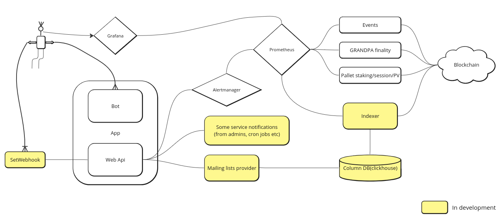

# Polkadot monitoring service

## Project Overview

Monitoring as a Service is a tool to track important metrics about ALL validators in Polkadot and Kusama networks using a user-friendly dashboard or subscribe to network events using flexible filters via the Telegram bot. For experienced and demanding we also plan to provide an API. The project is built on top of the well-known open-source monitoring solutions: Prometheus, Grafana, and Alertmanager and represents a set of exporters, a tg bot (written using AIOgram and AIOHTTP), and web API.



## Service implementations

1. Portable version(current project):

> NOTE In the portable version deploy of Grafana and the bot are independent. Bot just generates and saves local values.yml file.
> 

In the current repository, we provide:

- Full exporters collection (please see a picture above or read an explanation of each below)
- Prometheus with a minimal set of alert expressions. Alert manager connected.
- Alertmanager with webhook sender and route(send alerts to the bot)
- Grafana with a provisioned dashboard that contains some useful graphics
- Telegram bot

Everything dockerised. docker-compose.yml is presented.

2. Monitoring as a Service (cloud version of a service)
- Available via @p2pvalidator_monitoring_bot
- We maintain infrastructure and provide all support. No need to host anything.
- Metrics TTL = 30 days.
- 24/7/365 availability.

## Components

1. Telegram Bot
- Grafana instance deploy/destroy option
- Prometheus alerts enable/disable option
- Users support
- Administrators area(group chat)
    - What administrators can do:
    - Enable/Disable accounts
    - Participate in support conversations with clients. Can text any client through a bot.
    - Destroy grafana instance

> NOTE Administrators receive into group chat each event client did with the bot (completed action).
> 

2. Metrics

Common exporter:

- `polkadot_staking_currentEra`(chain) Current era
- `polkadot_staking_eraProgress`(chain) Era progress in percent
- `polkadot_staking_totalPoints`(chain) Amount of points earned by the whole network
- `polkadot_staking_eraPoints`(chain, account) Amount of points earned by validator in the current era
- `polkadot_staking_validatorsChart`(chain, account) Validator's position from best to worst
- `polkadot_session_currentSession`(chain) Current session index
- `polkadot_session_sessionProgress`(chain) Session progress in percent
- `polkadot_session_validators`(chain, account) Is validator active or not
- `polkadot_session_paraValidators`(chain, account) Paravalidator status
- `polkadot_pv_pointsMedian`(chain, account) Median ParaValidator points ratio
- `polkadot_pv_pointsAverage`(chain, account) Average ParaValidator points ratio
- `polkadot_pv_pointsP95`(chain, account) ParaValidator points ration 95 percentile
- `polkadot_pv_eraPoints`(chain, account) Amount of points earned by ParaValidator in the current session
- `polkadot_pv_paraValidatorsChart`(chain, account) ParaValidator's position from best to worst

Finality exporter:

- `polkadot_finality_roundsProcessed`(chain) Processed round - Rounds processed
- `polkadot_finality_prevotes`(chain, account) - Amount of success prevotes by validators
- `polkadot_finality_precommits`(chain, account) - Amount of success precommits by validators (became to 2/3)

Events exporter:

- `polkadot_events`(chain, module, method) - Occurred on-chain events counter
- `polkadot_events_by_account`(chain, module, method, account) - Occurred on-chain events with validator account
    - Event examples `Balances.Deposit`, `Balances.Locked`, `Balances.Reserved`, `Balances.Transfer`, `Balances.Unlocked`, `Balances.Upgraded`, `Balances.Withdraw`, `ImOnline.SomeOffline`, `Proxy.ProxyAdded`, `Staking.Bonded`, `Staking.Chilled`, `Staking.PayoutStarted`, `Staking.Rewarded`, `Staking.SlashReported`, `Staking.Unbonded`, `Staking.ValidatorPrefsSet`, `Staking.Withdrawn`, `TransactionPayment.TransactionFeePaid`, `VoterList.Rebagged`, `VoterList.ScoreUpdated`
    - `ParasDisputes.DisputeConcluded` - accounts considering candidate is Invalid, but majority conclusion = Valid

## How to setup, run, and test

1. Install Docker and Docker Compose from https://docs.docker.com/engine/install/	 or any other compose-compatible tool and container runtime
2. (Optional) Add RPC endpoints to config files `polkadot.env` and `kusama.env` in the following format:

```
WS_ENDPOINT="ws://your-node1:9944"
WS_ENDPOINTS="http://your-node1:9944,http://your-node2:9944,http://your-node3:9944/"

```

1. Configure bot by adding telegram bot api token and group chatId for administrators to `bot.env` Use `@botfather` to create bot. Don't forget to add your bot to administrators group.
2. Run the exporters, grafana and tg bot:
    - directly via docker-compose:
        - `docker-compose -f docker-compose.yml -f polkadot.yml -f kusama.yml up` - will start exporters for polkadot and kusama
        - `docker-compose -f docker-compose.yml -f polkadot.yml -f kusama.yml -f acala.yml -f karura.yml -f moonbeam.yml -f moonriver.yml -f astar.yml -f shiden.yml up` - will start exporters only for polkadot/kusama and parachains Acala/Karura, Moonbeam/Moonrive, Astar/Shiden.
3. Inspect the [dashboard](http://127.0.0.1:3000/d/fDrj0_EGz/p2p-org-polkadot-kusama-dashboard?orgId=1) (default username and password `admin`, `admin`)
4. Inspect the tg bot:
    1. Contact with your bot. Command `/start` will be good:)
    2. Try to build or destroy grafana instance(local version generates only `values.yml` which needed to provide to Grafana)
    3. Subscribe/Unsubscribe on alerts from bot.
  
## Project links 
1. Project web [page](maas.p2p.org)
2. Official user [guide] (https://p2p.org/economy/validator-monitoring-service-user-guide/)
3. Launching [announcement] (https://p2p.org/economy/validator-announces-new-validator-monitoring-service-updated/ )


## References

- https://github.com/polkascan/py-substrate-interface  - Python Substrate Interface. Many thanks to `Stichting Polkascan (Polkascan Foundation)` for amazing library implimentation which successfully used in exporters.
- https://github.com/itering/scale.go  - Go implementation of scale codec
- https://wiki.polkadot.network/  - Polkadot Wiki
- https://polkadot.js.org/docs/  - Good to know
- https://docs.aiogram.dev/en/latest/	  - AIOgram
- https://docs.aiohttp.org/en/stable/	  - AIOHTTP
